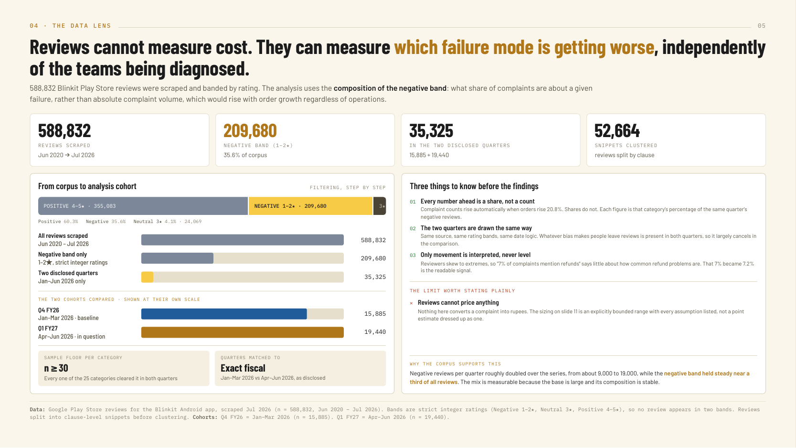
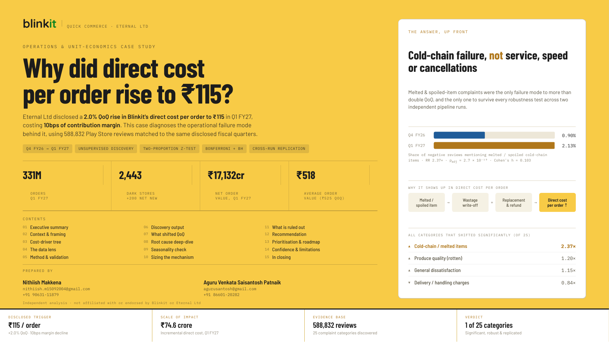
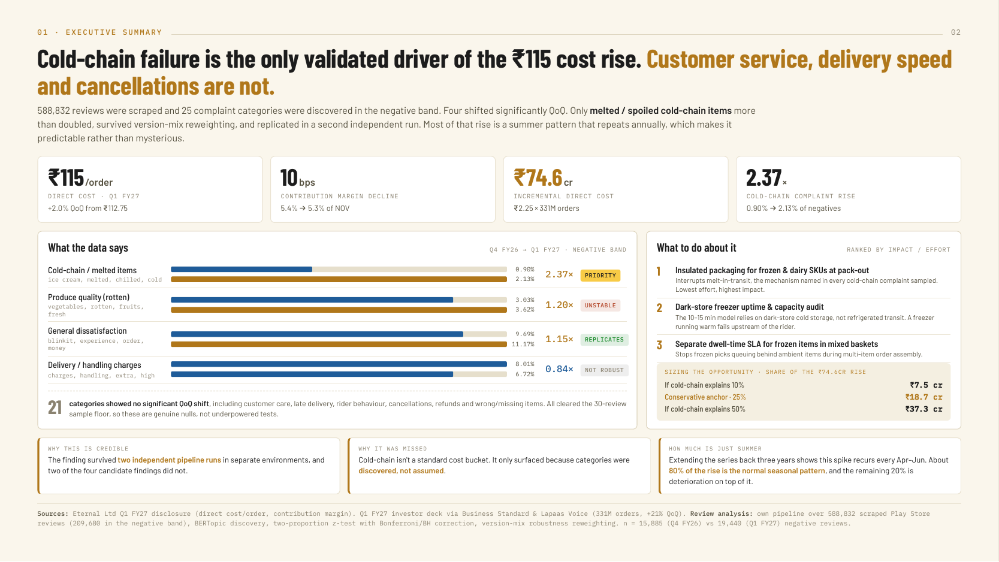

# Play Store Review Diagnostic

A statistical pipeline for finding out what's actually driving negative app
reviews, and whether it's gotten better or worse over time — built as a
case study on Blinkit, then generalized into a self-serve web app that
works on any Play Store app.

## Table of Contents

- [What this is](#what-this-is)
- [Method, in short](#method-in-short)
- [The Blinkit case study](#the-blinkit-case-study)
- [The generalized web app](#the-generalized-web-app)
- [Repository structure](#repository-structure)
- [Running it](#running-it)
- [Deploying the web app](#deploying-the-web-app)
- [Earlier project (V1)](#earlier-project-v1)

## What this is

Two things, same underlying methodology:

1. **[`final_pipeline_V2.ipynb`](final_pipeline_V2.ipynb)** — the 10-stage
   analysis pipeline that produced **[`Blinkit_Case_Study_2.pdf`](Blinkit_Case_Study_2.pdf)**.
2. **[`webapp/`](webapp/)** — the same methodology, productized: paste any
   Play Store app and package ID, get the same kind of diagnostic report
   back, on demand.

The pipeline notebook is the actual analysis code behind the case study —
included to document exactly how the finding was produced, not as a
turnkey script (it expects pre-scraped, pre-processed review data as
input, which isn't checked into this repo). The web app is the
generalized, runnable version of the same idea.

## Method, in short

588,832 Blinkit Play Store reviews were scraped and banded by star rating.
The negative band (209,680 reviews, strict 1–2★) is split into snippets
and clustered from scratch — 25 complaint categories emerge from the
corpus's own vocabulary, not a pre-written keyword list. Each category's
share of the negative band is compared between two disclosed fiscal
quarters (Q4 FY26 baseline vs. Q1 FY27) with a two-proportion z-test and
Cohen's h effect size, corrected for testing many categories at once
(Bonferroni for pre-registered hypotheses, Benjamini–Hochberg for the rest
discovered by clustering). A finding only counts if it also survives a
version-mix robustness reweighting check and replicates in a second,
independently-run pipeline — significance alone was never treated as
evidence on its own.



## The Blinkit case study

Eternal Ltd disclosed a 2.0% QoQ rise in Blinkit's direct cost per order,
to ₹115 in Q1 FY27 — a 10bps hit to contribution margin. The case study
matches 588,832 Play Store reviews to the same disclosed quarters to
diagnose which operational failure is actually behind it.



**[Blinkit_Case_Study_2.pdf](Blinkit_Case_Study_2.pdf)** — the full
16-slide deck. Four of the 25 discovered categories shifted significantly
quarter-over-quarter; only one both survived version-mix reweighting *and*
replicated in an independently-run pipeline:

| Complaint category | Q4 FY26 | Q1 FY27 | Rate ratio | Verdict |
|---|---|---|---|---|
| **Cold-chain / melted items** (ice cream, chilled, cold) | 0.90% | 2.13% | **2.37×** | 🟡 **Priority** — validated, drives the finding |
| Produce quality (rotten vegetables/fruits) | 3.03% | 3.62% | 1.20× | Unstable — doesn't replicate across runs |
| General dissatisfaction (generic "bad experience") | 9.69% | 11.17% | 1.15× | Replicates, but not a specific/actionable mechanism |
| Delivery / handling charges | 8.01% | 6.72% | 0.84× | Not robust — falls apart under version-mix reweighting |

21 other categories — including customer care, late delivery, rider
behaviour, cancellations, refunds, and wrong/missing items — showed no
significant quarter-over-quarter shift; all cleared the 30-review sample
floor, so these are genuine nulls, not underpowered tests.



**[final_pipeline_v2_architecture.html](final_pipeline_v2_architecture.html)**
— the 10-stage architecture diagram the notebook implements.

**[final_pipeline_V2.ipynb](final_pipeline_V2.ipynb)** — the pipeline itself:

| Stage | What it does |
|---|---|
| Population split | Dedupe to review level, parse dates, split into strict Negative / Neutral / Positive rating bands across every quarter |
| Discovery — Negative / Neutral / Positive | Three independent embed → UMAP → BERTopic passes, one per band, each with its own resolution search; only Negative's categories feed the stats, Neutral/Positive are exploratory deck content |
| Generalized measurement | Measures every review, every quarter, every band against the Negative category centroids, version-blind |
| Stats engine | Two-proportion z-test + Cohen's h per category, sample-size floor, two-tier correction (Bonferroni for pre-registered hypotheses, Benjamini–Hochberg for clustering-discovered ones) |
| Version-mix robustness | Reweights the later cohort's version-specific rates to the earlier cohort's version mix, checks whether each significant finding survives |
| Co-occurrence & deep dives | Root-cause crosstabs (e.g. what else co-occurs with "customer care" complaints) and a pre/post-1P wastage deep dive |
| Ranked diagnostic assembly | Assembles the five final output tables that feed the deck's slides, deterministically, from the upstream stages |

## The generalized web app

`webapp/` turns the same methodology into a tool that works on any Play
Store app, not just Blinkit — no hardcoded hypotheses, no fixed keyword
lists, no Blinkit-specific dates.

- Paste a package ID and pick how many reviews to analyze.
- **Up to 200 reviews**: instant, rendered in-browser.
- **201–1,000 reviews**: queued as a background job, results emailed
  (via Gmail's SMTP relay) since the run is too slow to wait on.
- Reviews are auto-split into two cohorts by recency (most recent half vs.
  prior half); categories are discovered directly from review text, and
  each category's share of the Negative band is compared across cohorts
  with the same z-test / Cohen's h / Benjamini–Hochberg approach above.
- Nothing is stored — every run is stateless.

See [`webapp/README.md`](webapp/README.md) for the full layout and local
dev instructions.

## Repository structure

```
final_pipeline_V2.ipynb            The Blinkit case study's analysis pipeline (10 stages)
final_pipeline_v2_architecture.html  Architecture diagram for the pipeline above
Blinkit_Case_Study_2.pdf           16-slide case study deck (the pipeline's output)
images_v2/                         Slide exports embedded above (headline, findings, data lens)
requirements_v2.txt                Dependencies for final_pipeline_V2.ipynb
webapp/                            Generalized, self-serve version of the same methodology
  app.py                             Gradio UI, job queue, keep-alive thread
  theme.css                          Design system
  requirements.txt                   Dependencies for the web app
  review_diagnostics/                scrape / discover / measure / test / report modules
render.yaml                        Render deployment blueprint for webapp/

# Earlier project (see below)
AI_App_Review_Insights.ipynb       V1: LDA + Gemini pipeline, Meesho case study
meesho_case_study.pdf
images/
requirements.txt
```

## Running it

**The web app** (fully runnable — no external data needed, scrapes live):

```bash
pip install -r webapp/requirements.txt
python webapp/app.py
```

Opens at `http://localhost:7860`.

**The case study notebook** (reference — needs its own pre-processed input
data, not included here):

```bash
pip install -r requirements_v2.txt
jupyter notebook final_pipeline_V2.ipynb
```

## Deploying the web app

`webapp/` is host-agnostic and binds to `0.0.0.0:$PORT`. See
[`render.yaml`](render.yaml) at the repo root for a ready-to-use Render
Blueprint (`rootDir: ./webapp`).

## Earlier project (V1)

This repo also contains an earlier, separate project: an LDA + Gemini
review-insight pipeline applied to a Meesho case study —
[`AI_App_Review_Insights.ipynb`](AI_App_Review_Insights.ipynb) and
[`meesho_case_study.pdf`](meesho_case_study.pdf), with supporting visuals
in [`images/`](images/) and its own [`requirements.txt`](requirements.txt).

## License

MIT — see [LICENSE](LICENSE).
