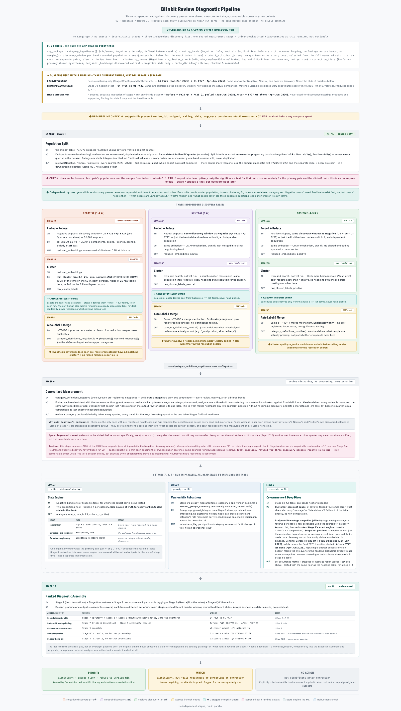
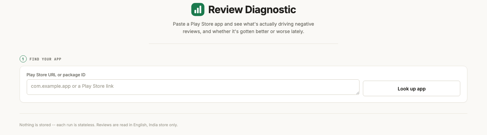
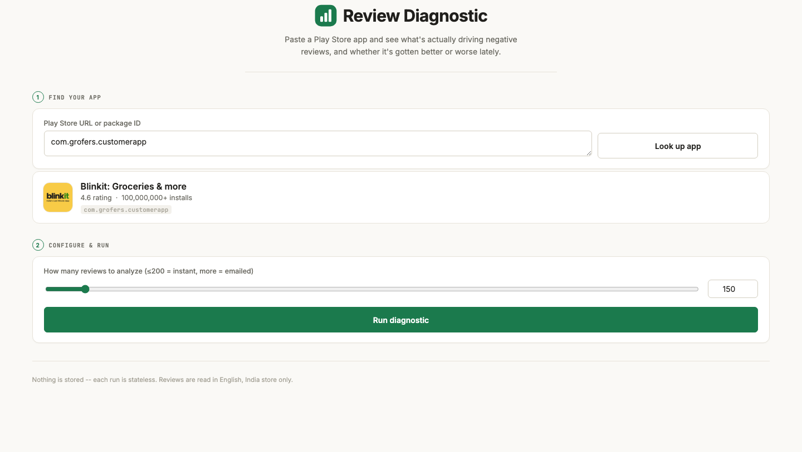
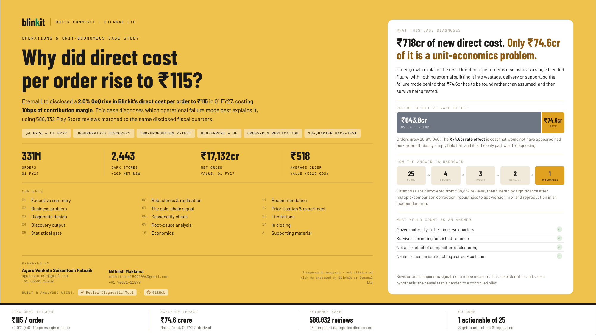
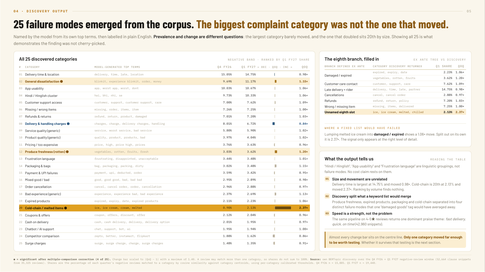
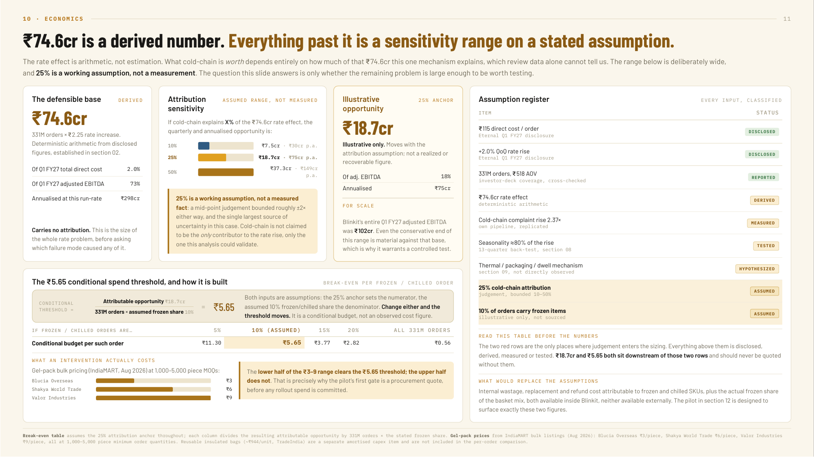
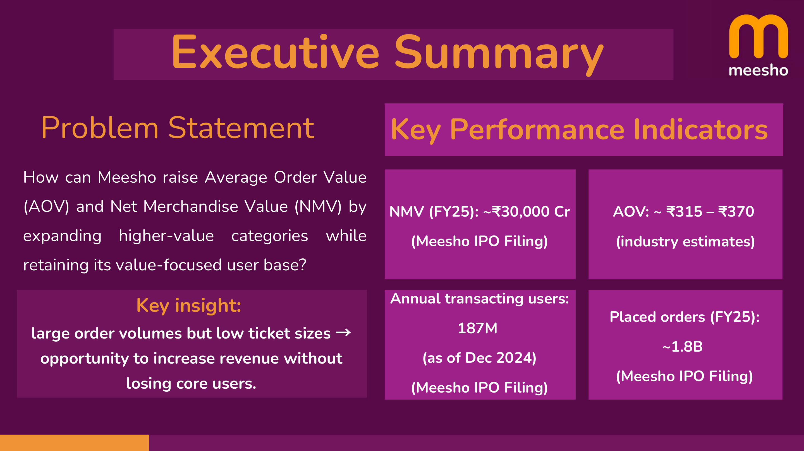
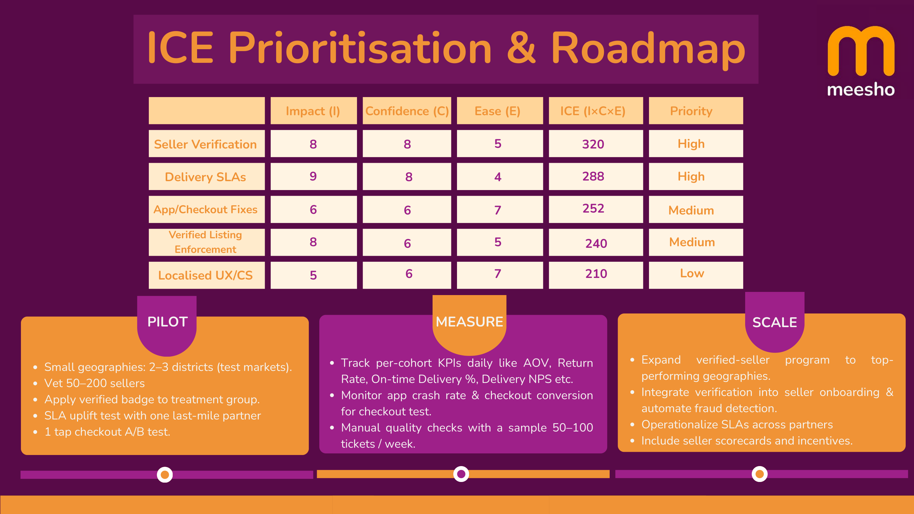

# Play Store Review Diagnostic

A statistical pipeline for finding out what's actually driving negative app
reviews, and whether it's gotten better or worse over time. Built as a
10-stage architecture, productized into a self-serve web app that works on
any Play Store app, and proven out as two independent case studies
(Blinkit, Meesho).

**Try the live app:** [review-diagnostic.onrender.com](https://review-diagnostic.onrender.com/)

## Table of Contents

- [What this is](#what-this-is)
- [The architecture](#the-architecture)
- [The generalized web app](#the-generalized-web-app)
- [The Blinkit case study](#the-blinkit-case-study)
- [The Meesho case study](#the-meesho-case-study)
- [Repository structure](#repository-structure)
- [Running it](#running-it)
- [Deploying the web app](#deploying-the-web-app)

## What this is

Three things, same underlying methodology:

1. **[`final_pipeline_v2_architecture.html`](final_pipeline_v2_architecture.html)**
   and **[`final_pipeline_V2.ipynb`](final_pipeline_V2.ipynb)**, the
   10-stage analysis architecture and the notebook that implements it.
2. **[`webapp/`](webapp/)**, the same methodology, productized: paste any
   Play Store app and package ID, get the same kind of diagnostic report
   back, on demand. Live at
   [review-diagnostic.onrender.com](https://review-diagnostic.onrender.com/).
3. Two case studies produced by that methodology:
   **[`Blinkit_Case_Study.pdf`](Blinkit_Case_Study.pdf)** (the primary,
   most rigorous application) and **[`meesho_case_study.pdf`](meesho_case_study.pdf)**
   (an earlier, simpler pass using a different toolset).

## The architecture

Three independent rating-band discovery passes (Negative, Neutral,
Positive), one shared measurement stage, comparable across any two
cohorts. No agents, no orchestration framework: a deterministic,
config-driven notebook run, checkpointed so a Colab free-tier session can
resume where it left off.



| Stage | What it does |
|---|---|
| Population split | Dedupe to review level, parse dates, split into strict Negative / Neutral / Positive rating bands across every quarter |
| Discovery, Negative / Neutral / Positive | Three independent embed, reduce, cluster passes, one per band, each with its own resolution search; only Negative's categories feed the stats, Neutral/Positive are exploratory |
| Generalized measurement | Measures every review, every quarter, every band against the Negative category centroids, version-blind |
| Stats engine | Two-proportion z-test plus Cohen's h per category, sample-size floor, two-tier correction (Bonferroni for pre-registered hypotheses, Benjamini-Hochberg for clustering-discovered ones) |
| Version-mix robustness | Reweights the later cohort's version-specific rates to the earlier cohort's version mix, checks whether each significant finding survives |
| Co-occurrence and deep dives | Root-cause crosstabs (what else co-occurs with a "customer care" complaint) and a pre/post-1P wastage deep dive |
| Ranked diagnostic assembly | Assembles the final output tables that feed the deck's slides, deterministically, from the upstream stages, tagged priority / watch / no action |

**[final_pipeline_V2.ipynb](final_pipeline_V2.ipynb)** is the pipeline
itself, included to document exactly how the findings were produced, not
as a turnkey script (it expects pre-scraped, pre-processed review data as
input, which isn't checked into this repo).

## The generalized web app

`webapp/` turns the architecture above into a tool that works on any Play
Store app, not just Blinkit: no hardcoded hypotheses, no fixed keyword
lists, no app-specific dates. Live at
**[review-diagnostic.onrender.com](https://review-diagnostic.onrender.com/)**.





- Paste a package ID and pick how many reviews to analyze.
- **Up to 200 reviews**: instant, rendered in-browser.
- **201 to 1,000 reviews**: queued as a background job, results emailed
  (via Brevo) since the run is too slow to wait on.
- Reviews are auto-split into two cohorts by recency (most recent half vs.
  prior half); categories are discovered directly from review text, and
  each category's share of the Negative band is compared across cohorts
  with the same z-test / Cohen's h / Benjamini-Hochberg approach above.
- Nothing is stored: every run is stateless.

See [`webapp/README.md`](webapp/README.md) for the full layout and local
dev instructions.

## The Blinkit case study

Eternal Ltd disclosed a 2.0% QoQ rise in Blinkit's direct cost per order,
to ₹115 in Q1 FY27, a 10bps hit to contribution margin. The case study
matches 588,832 Play Store reviews to the same disclosed quarters to
diagnose which operational failure is the leading hypothesis behind it.



**[Blinkit_Case_Study.pdf](Blinkit_Case_Study.pdf)**, the full deck. 25
complaint categories are discovered directly from the corpus's own
vocabulary, not matched to a pre-written keyword list, shown in full
below because that comparison is what rules out cherry-picking:



Four of the 25 shifted significantly quarter-over-quarter; only two
survived version-mix reweighting *and* replication in an independently-run
pipeline. Twenty-one other categories, including customer care, late
delivery, rider behaviour, cancellations, refunds, and wrong/missing
items, showed no statistically significant or material shift; all cleared
the 30-review sample floor, so these are genuine nulls, not underpowered
tests.

What cold-chain is worth depends on an assumption review data alone can't
measure, so the deck keeps the derived rate effect and the assumed
attribution share visibly separate:



## The Meesho case study

An earlier, simpler pass at the same kind of question: how Meesho could
raise Average Order Value and Net Merchandise Value. Uses LDA topic
modelling and Gemini-assisted synthesis rather than the BERTopic and
statistical-testing pipeline above, and reasons over publicly available
KPIs (IPO filing figures, industry estimates) rather than an internal
disclosed metric matched against reviews.





See [Earlier project (V1)](#repository-structure) below for the full
notebook and supporting visuals.

## Repository structure

```
final_pipeline_V2.ipynb              The Blinkit case study's analysis pipeline (10 stages)
final_pipeline_v2_architecture.html  Architecture diagram for the pipeline above
Blinkit_Case_Study.pdf               Case study deck (the pipeline's output)
meesho_case_study.pdf                V1's case study deck (see below)
images_v2/                           Slide and architecture exports embedded above
requirements_v2.txt                  Dependencies for final_pipeline_V2.ipynb
webapp/                              Generalized, self-serve version of the same methodology
  server.py                            FastAPI app, job queue, keep-alive thread
  static/                              Frontend (HTML/JS/CSS)
  requirements.txt                     Dependencies for the web app
  review_diagnostics/                  scrape / discover / measure / test / report modules
render.yaml                          Render deployment blueprint for webapp/
LICENSE

v1_meesho_review_insights/           Earlier, separate project
  AI_App_Review_Insights.ipynb         V1: LDA plus Gemini pipeline
  images/                              Supporting visuals
  requirements.txt                     Dependencies for the V1 notebook
```

## Running it

**The web app** (fully runnable, no external data needed, scrapes live):

```bash
pip install -r webapp/requirements.txt
python webapp/server.py
```

**The case study notebook** (reference, needs its own pre-processed input
data, not included here):

```bash
pip install -r requirements_v2.txt
jupyter notebook final_pipeline_V2.ipynb
```

## Deploying the web app

`webapp/` is host-agnostic and binds to `0.0.0.0:$PORT`. See
[`render.yaml`](render.yaml) at the repo root for a ready-to-use Render
Blueprint (`rootDir: ./webapp`). The current deployment is live at
[review-diagnostic.onrender.com](https://review-diagnostic.onrender.com/).

## License

MIT, see [LICENSE](LICENSE).
